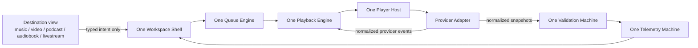

# Workspace V2 Architecture Contract

Status: Architecture lock active.

This document is the contract for Workspace V2. No new Workspace V2 feature work should begin until changes are checked against this contract.

## North Star

Workspace V2 must become:



The product rule is simple:

One Shell. One Player. One Queue Engine. Many Destinations.

## Hard Rules

1. There is one Workspace Shell.
2. There is one Queue Engine.
3. There is one Playback Engine.
4. Provider-specific logic belongs only in provider adapters.
5. Destination views cannot own playback, validation, provider lifecycle, or queue advancement.
6. The destination model must support future music, video, podcast, audiobook, and livestream content.

## Ownership Boundaries

### Workspace Shell

Owns:

- App-level workspace composition.
- Rendering the persistent player host.
- Rendering destination panels.
- Passing user intents to the controller.

Must not own:

- Provider-specific code.
- Queue advancement rules.
- Playback state transitions.
- Validation rules.
- Time Bank or token writes.

### Queue Engine

Authoritative file today:

- `lib/workspace-v2/queue-machine.ts`

Owns:

- Active queue.
- Current item.
- Next item.
- Queue position.
- Consumed item IDs.
- Queue refill policy.
- Queue advancement.

Forbidden elsewhere:

- Local `currentIndex` state.
- Local `remainingSongs` mutation.
- Destination-level `next song` logic.
- Provider-level queue advancement.

### Playback Engine

Authoritative file today:

- `lib/workspace-v2/playback-machine.ts`

Owns:

- `loading`
- `ready`
- `playing`
- `paused`
- `completed`
- `error`
- Manual pause state.
- Provider command emission.

Forbidden elsewhere:

- Components creating their own playback state machine.
- Destination views deciding autoplay continuation.
- Provider adapters advancing the queue.

### Provider Adapters

Own:

- Provider API loading.
- Provider iframe/player lifecycle.
- Provider-specific play/pause commands.
- Provider-specific cleanup.
- Provider-specific telemetry translation.

Must emit only normalized Workspace V2 events:

- `ready`
- `playing`
- `paused`
- `completed`
- `telemetry`
- `error`

Must not own:

- Queue decisions.
- Time Bank decisions.
- Reward decisions.
- Valid-listen decisions.
- Destination routing.

### Validation Machine

Authoritative file today:

- `lib/workspace-v2/validation-machine.ts`

Owns:

- Whether playback is progressing.
- Whether playback is eligible.
- Fair Skip.
- Valid listen.
- Rejection reason.

Must consume only normalized provider snapshots. It must not import YouTube, Spotify, SoundCloud, Apple Music, TikTok, or any provider SDK type.

### Telemetry Machine

Authoritative file today:

- `lib/workspace-v2/telemetry-machine.ts`

Owns:

- UI-safe playback counters.
- Current progress.
- Live time.
- Reward-eligible seconds.
- Valid-listen display state.

Must consume validation output and normalized snapshots only.

## Destination Model Contract

The current type is still song-centered:

- `WorkspaceV2Song`
- `WorkspaceV2Queue`

This is acceptable only for the current preview. The production contract should migrate toward a generic playable item shape before Workspace V2 becomes the permanent shell.

Required future shape:

```ts
type WorkspaceDestinationKind =
  | "music"
  | "video"
  | "podcast"
  | "audiobook"
  | "livestream";

type WorkspacePlaybackKind = "internal" | "external";

type WorkspacePlayableItem = {
  id: string;
  destinationKind: WorkspaceDestinationKind;
  playbackKind: WorkspacePlaybackKind;
  title: string;
  creatorName: string;
  creatorId?: string;
  artworkUrl?: string;
  durationSeconds?: number | null;
  canonicalUrl: string;
  primaryProvider: string;
  providerLinks: Array<{
    provider: string;
    url: string;
    playbackRole: "primary" | "destination";
  }>;
  discovery: {
    exposureScore?: number | null;
    lastConsumedAt?: number | null;
    source?: string;
  };
};
```

Queue logic must operate on `WorkspacePlayableItem` behavior, not on music-only assumptions.

## Current Audit Findings

### Good

- `lib/workspace-v2/playback-machine.ts` is provider-agnostic and owns playback states.
- `lib/workspace-v2/queue-machine.ts` is separated from the UI and owns current item and advancement.
- `lib/workspace-v2/validation-machine.ts` consumes normalized snapshots rather than provider SDK objects.
- `lib/workspace-v2/telemetry-machine.ts` consumes validation output and normalized snapshots.
- `components/workspace-v2/workspace-v2-controller.tsx` is the current reducer bridge between machines.
- `/workspace-v2-preview` is Founder-only and sandboxed.

### Architecture Debt

1. `components/provider-player.tsx` is still a monolithic legacy player.

   It contains YouTube, Spotify, and SoundCloud API loading, iframe handling, telemetry, autoplay retries, active-playback events, cleanup, and provider-specific state in one component. This violates the final Provider Adapter rule and is allowed only as a temporary bridge.

2. `components/workspace-v2/workspace-v2-provider-player-adapter.tsx` still wraps the legacy `ProviderPlayer`.

   It normalizes telemetry, which is good, but it also depends on platform display names and falls back to `YouTube Music`. That fallback is music-specific and should move into provider resolution, not the Workspace adapter.

3. `components/workspace-v2/workspace-v2-shell.tsx` is currently a preview shell, not the final shell.

   It includes diagnostics, memory timers, instrumentation logs, debug counters, and preview-only controls. These must be extracted into a preview diagnostics panel before production Workspace V2 switch.

4. `app/workspace-v2-preview/page.tsx` filters provider platforms directly.

   The preview currently filters `youtube_music`, `youtube`, and `soundcloud`. This is acceptable for a Founder sandbox, but production destinations must request playable items through a provider-agnostic destination resolver.

5. `lib/workspace-v2/types.ts` is song-centered.

   `WorkspaceV2Song` and music-specific queue sources are acceptable for Phase 1 preview only. The permanent architecture must support generic playable content.

6. `lib/workspace-v2/provider-interface.ts` defines a provider bus but is not yet the actual enforced boundary.

   The adapter currently uses `ProviderPlayer` props and browser `CustomEvent` commands. The final boundary should route provider commands and events through the provider interface or an equivalent typed controller boundary.

## Provider-Specific Code Audit

Provider-specific code currently exists in:

- `components/provider-player.tsx`
- `components/workspace-v2/workspace-v2-provider-player-adapter.tsx`
- `app/workspace-v2-preview/page.tsx`

Provider-specific code should eventually exist only in:

- `components/workspace-v2/providers/*`
- or `lib/workspace-v2/providers/*`

Allowed provider adapter responsibilities:

- Load provider SDK.
- Create provider player.
- Translate provider events to Workspace V2 events.
- Translate provider telemetry to Workspace V2 snapshots.
- Cleanup provider resources.

Forbidden provider adapter responsibilities:

- Queue refill.
- Queue advancement.
- Reward state.
- Valid listen.
- Time Bank.
- Destination navigation.

## Queue Duplication Audit

Current duplicated or risky queue-related code:

- Preview shell renders queue state and calls `controller.next()`.
- Controller dispatches `next`.
- Queue machine performs the actual advancement.

This is acceptable only because the shell is invoking an intent. The permanent rule is:

Destination and shell components may request `next`, but only the Queue Machine may change the queue.

No destination card, song card, provider component, or review component may mutate queue position.

## Playback Duplication Audit

Current duplicated or risky playback-related code:

- Playback Machine owns logical playback state.
- Legacy `ProviderPlayer` owns internal provider playback state for UI and provider mechanics.
- Workspace shell tracks debug state, last transition, and pipeline counters.

This is acceptable only in preview. The production rule is:

The Playback Machine owns application playback state. Provider components may keep private mechanical state only when needed to operate a provider SDK, but that state must be translated immediately into normalized events.

## Forbidden Imports

Destination views must not import:

- `components/provider-player`
- Provider SDK loaders.
- `reduceWorkspaceV2Queue`
- `reduceWorkspaceV2Playback`
- Provider-specific adapter files.

Provider adapters must not import:

- Queue machine reducers.
- Validation machine reducers.
- Telemetry machine reducers.
- Time Bank logic.
- Token economy logic.

Queue, playback, validation, and telemetry machines must not import:

- React.
- Supabase.
- Provider SDK types.
- UI components.

## Acceptance Gates Before Production Switch

Workspace V2 cannot replace production until:

- The final shell uses one persistent player host.
- Provider-specific code is isolated behind adapter boundaries.
- Queue advancement is only possible through the Queue Machine.
- Playback state is only owned by the Playback Machine.
- Validation receives only normalized provider snapshots.
- Destination data supports `music`, `video`, `podcast`, `audiobook`, and `livestream`.
- `npm run workspace-v2:verify` passes.
- `npm run lint` passes.
- `npm run build` passes.
- Founder Preview confirms continuous playback without remount loops, stuck telemetry, duplicate players, or memory growth.

## Architecture Lock Decision

Workspace V2 may continue only with stabilization or contract-compliance work until these boundaries are respected.

Allowed next work:

- Split provider-specific code into provider adapters.
- Replace song-only types with generic playable destination types.
- Move preview diagnostics out of the production shell path.
- Route provider commands through a typed provider interface instead of global browser events.
- Add tests that enforce the import boundaries above.

Blocked next work:

- New discovery features.
- New queue behaviors.
- New reward behaviors.
- New provider features.
- New UI surfaces unrelated to Workspace V2 stabilization.
